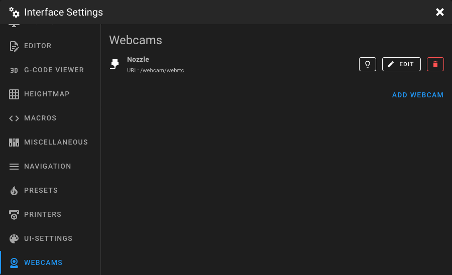
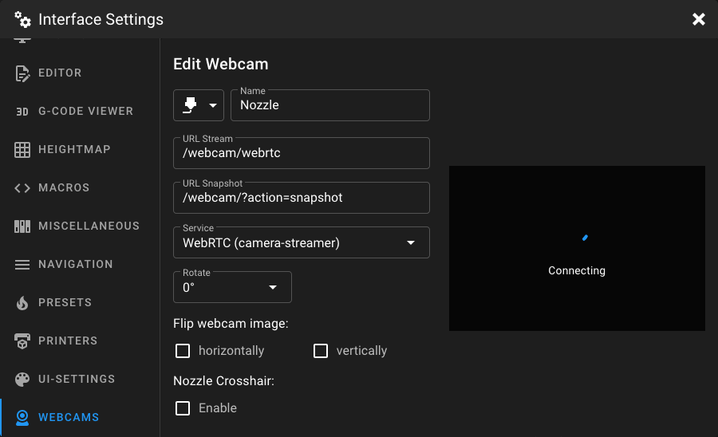

# Webcams Settings

Open the **Interface Settings** by clicking the **cogs icon** in the top-right corner, then navigate to **Webcams**.

<figure markdown="span">
  
</figure>

This page lets you manage your webcam configurations. You can add multiple webcams, each with its own streaming service,
URLs, and display options. Click **Add Webcam** to create a new webcam, or click **Edit** on an existing one.

If a `crowsnest.conf` file exists in your config directory, an **Edit crowsnest.conf** button is shown to quickly open
the Crowsnest configuration in the editor.

## Adding or Editing a Webcam

When adding or editing a webcam, a form is displayed with a live preview on the right side.

<figure markdown="span">
  
</figure>

### Name and Icon

Enter a unique name for the webcam and select an icon from the dropdown. The following icons are available:

| Icon                | Description          |
|---------------------|----------------------|
| **Printer**         | 3D printer icon      |
| **Nozzle**          | Nozzle icon          |
| **Bed**             | Print bed icon       |
| **Cam** *(default)* | Webcam icon          |
| **Filament**        | Filament spool icon  |
| **Door**            | Door icon            |
| **MCU**             | Microcontroller icon |
| **Hot**             | Heat/fire icon       |

### URL Stream

The URL of the video stream. This can be different depending on your webcam setup and the streaming service you choose.
For example, if you're using MJPEG-Streamer, the stream URL might look like `http://<IP_ADDRESS>:8080/?action=stream`.

!!! tip "MainsailOS Default URLs"
    In MainsailOS, four webcam ports are mapped to URLs by default:

    | Webcam | Stream URL | Snapshot URL |
    |--------|-----------|--------------|
    | 1st | `/webcam/?action=stream` | `/webcam/?action=snapshot` |
    | 2nd | `/webcam2/?action=stream` | `/webcam2/?action=snapshot` |
    | 3rd | `/webcam3/?action=stream` | `/webcam3/?action=snapshot` |
    | 4th | `/webcam4/?action=stream` | `/webcam4/?action=snapshot` |

### URL Snapshot

The URL for capturing a single snapshot image. This is required for the Adaptive MJPEG-Streamer service and for
Timelapse recordings. For MJPEG-Streamer, the snapshot URL is typically `http://<IP_ADDRESS>:8080/?action=snapshot`.

### Service

Select the streaming service that matches your webcam setup:

| Service                      | Description                                                                                                                                                                                                                                                                                            |
|------------------------------|--------------------------------------------------------------------------------------------------------------------------------------------------------------------------------------------------------------------------------------------------------------------------------------------------------|
| **MJPEG-Streamer**           | This is an optimized solution for MJPEG streams. The streamer mode extracts individual frames from the stream URL and displays them. This is to prevent the buildup of delay in case of insufficient bandwidth. **IMPORTANT:** This mode does currently not work on iOS devices for technical reasons. |
| **Adaptive MJPEG-Streamer**  | Pulls individual images from the snapshot URL at a configurable frame rate. Prevents delay buildup.                                                                                                                                                                                                    |
| **UV4L-MJPEG**               | Classic MJPEG stream embedded in an image tag. Simple and widely compatible, but delay can build up over time. Only a browser reload will help.                                                                                                                                                        |
| **HTML Video**               | Embeds the stream URL in an HTML5 video element. Browser plugins may be required.                                                                                                                                                                                                                      |
| **HTML Iframe**              | Embeds the stream URL as a webpage inside an iframe. Not a video stream, but supports rotation and flip options.                                                                                                                                                                                       |
| **WebRTC (camera-streamer)** | WebRTC stream via camera-streamer. Low latency and bandwidth efficient.                                                                                                                                                                                                                                |
| **WebRTC (go2rtc)**          | WebRTC stream via go2rtc. Low latency with optional audio support.                                                                                                                                                                                                                                     |
| **WebRTC (MediaMTX)**        | WebRTC stream via MediaMTX. Also works with WYZE-Cams using docker-WYZE-Bridge. Requires MediaMTX v0.23 or newer.                                                                                                                                                                                      |
| **WebRTC (janus-gateway)**   | WebRTC stream via Janus Gateway.                                                                                                                                                                                                                                                                       |
| **HLS Stream**               | HTTP Live Streaming. Bandwidth efficient, but with higher latency.                                                                                                                                                                                                                                     |
| **Raw h264 stream (jmuxer)** | Raw h264 stream decoded via jmuxer in the browser.                                                                                                                                                                                                                                                     |

### Target FPS

Set the target frame rate (frames per second) for the stream. This controls how often per second an image is requested.
Only available for **Adaptive MJPEG-Streamer**.

### Rotation

Rotate the webcam image. Available options: **0°**, **90°**, **180°**, **270°**. Available for most services.

### Aspect Ratio

Set the aspect ratio of the webcam display. Only available for **HTML Iframe**. Use the format `WIDTH:HEIGHT` (e.g.
`16:9`). The `/` separator is also accepted.

### Hide FPS Counter

When enabled, the FPS counter overlay is hidden on the webcam image. Only available for **MJPEG-Streamer** and
**Adaptive MJPEG-Streamer**.

### Enable Audio

When enabled, audio from the webcam stream is played. Only available for **WebRTC (go2rtc)**.

### Flip Webcam Image

Flip the webcam image:

- **horizontally**: mirrors the image left to right
- **vertically**: mirrors the image top to bottom

Enabling both corresponds to a 180° rotation.

### Nozzle Crosshair

Overlay a crosshair on the webcam image to help align the nozzle. Only available for **MJPEG-Streamer**, **Adaptive
MJPEG-Streamer**, and **WebRTC (camera-streamer)**.

When enabled, the following options appear:

| Setting   | Description                                           |
|-----------|-------------------------------------------------------|
| **Color** | Set the crosshair color using a color picker.         |
| **Size**  | Adjust the crosshair size with a slider (0.01 – 1.0). |

## Deleting a Webcam

Click the delete button next to a webcam in the list to remove it.
