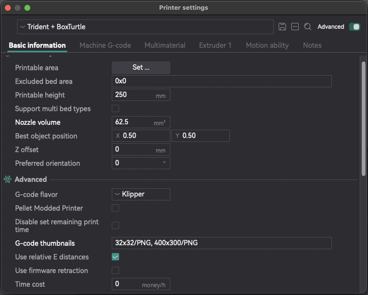
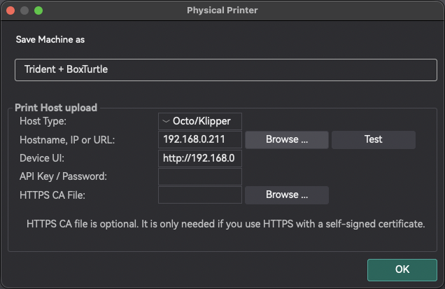

# OrcaSlicer

Configure [OrcaSlicer](https://github.com/SoftFever/OrcaSlicer){:target="_blank"} for optimal use with Mainsail and Klipper.

## Thumbnails

To display thumbnail previews in Mainsail, you need to configure the G-code flavor and thumbnail settings in OrcaSlicer.

1. Open the **Printer Settings** (the button behind the printer dropdown in the top of the sidebar)
2. Navigate to the **Basic information** section
3. Set **G-code flavor** to `Klipper`
4. Set **G-code thumbnails** to `32x32/PNG, 400x300/PNG`

<figure markdown="span">

</figure>

## Layer Information

To have Slicer based layer information displayed in Mainsail, you have to add some lines of G-Code to the Slicer
Printer Settings. Open the **Printer Settings** (the button behind the printer dropdown in the top of the sidebar) and
then **Machine G-code** and set these lines of G-Code:

1. Start G-Code (before your start G-Code):
  ```
  SET_PRINT_STATS_INFO TOTAL_LAYER=[total_layer_count]
  ```

2. End G-Code (at the last line):
  ```
  ; total layers count = [total_layer_count]
  ```

3. After layer change G-Code:
  ```
  SET_PRINT_STATS_INFO CURRENT_LAYER={layer_num + 1}
  ```

## Exclude Objects

OrcaSlicer has native support for Klipper's Exclude Objects feature and adds the necessary G-Codes to the generated
G-code file. You just need to set the G-Code flavor to `Klipper`.

1. Open the **Printer Settings** (the button behind the printer dropdown in the top of the sidebar)
2. Set **G-code flavor** to `Klipper`

<figure markdown="span">

</figure>

## Upload to Printer

Upload G-code files directly from OrcaSlicer to your printer using the built-in upload to Moonraker.

1. Open the **Physical Printer** dialog (the button behind the printer dropdown in the top of the sidebar)
2. Set **Host Type** to `Octo/Klipper`
3. Enter the Hostename, IP or URL of your Moonraker instance, e.g., `mainsail.local`
4. (Optional) Enter the **Device UI** URL of your Mainsail instance, e.g., `http://mainsail.local`
5. Click on `Test` to verify the connection

<figure markdown="span">

</figure>

After configuration, you can upload G-code directly to your printer using the **Print** button in the top-right corner
of the OrcaSlicer interface.
