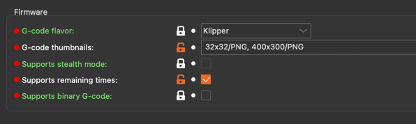
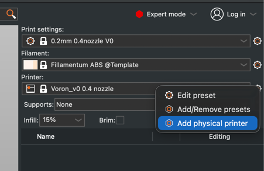
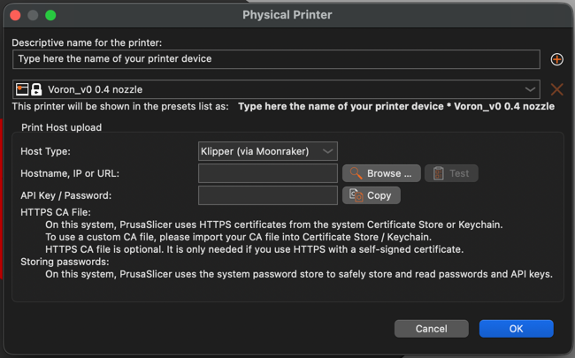

# PrusaSlicer

Configure [PrusaSlicer](https://github.com/prusa3d/PrusaSlicer){:target="_blank"} for optimal
use with Mainsail and Klipper.

## Thumbnails

To display thumbnail previews in Mainsail, you need to configure the G-code flavor and
thumbnail settings in PrusaSlicer.

1. Open **Printer Settings** > **General**
2. Set **G-code flavor** to `Klipper`
3. Set **G-code thumbnails** to `32x32/PNG, 400x300/PNG`



## Layer Information

To have Slicer based layer information displayed in Mainsail, you have to add some lines of G-Code to the Slicer
Printer Settings. Open the **Printers** Tab (in the topbar) and then **Custom G-code** set these lines of G-Code:

1. Start G-Code (before your start G-Code):
  ```
  SET_PRINT_STATS_INFO TOTAL_LAYER=[total_layer_count]
  ```

2. End G-Code (at the last line):
  ```
  ; total layers count = [total_layer_count]
  ```

3. After layer change G-Code:
  ```
  SET_PRINT_STATS_INFO CURRENT_LAYER={layer_num + 1}
  ```

## Exclude Objects

PrusaSlicer 2.7.0 and newer supports native object labeling for Klipper's Exclude Objects
feature, eliminating the need for Moonraker preprocessing.

1. Open **Printer Settings** > **General**
2. Set **G-code flavor** to `Klipper`
3. Open **Print Settings** > **Output options**
4. Set **Label objects** to `Firmware-specific`


!!! note "Version Requirement"
    Native Exclude Objects support requires PrusaSlicer version 2.7.0 or newer. For older
    versions, use [Moonraker preprocessing](../features/exclude-objects.md#moonraker-preprocessing).

## Upload to Printer

Upload G-code files directly from PrusaSlicer to your printer using the Physical Printer
feature with Moonraker integration.

1. Click the **cogs icon** next to the printer name
2. Select **Add physical printer**

    

3. Configure the physical printer settings:
   
    - **Host Type:** `Klipper (via Moonraker)`
    - **Hostname, IP or URL:** Your Mainsail address, e.g., `mainsail.local`
  
    

4. Click **Test** to verify the connection
5. Click **OK** to save

After configuration, you can upload G-code directly to your printer using the **Send to
printer** button in the slice dialog or via **File** > **Export** > **Send a G-Code**.
