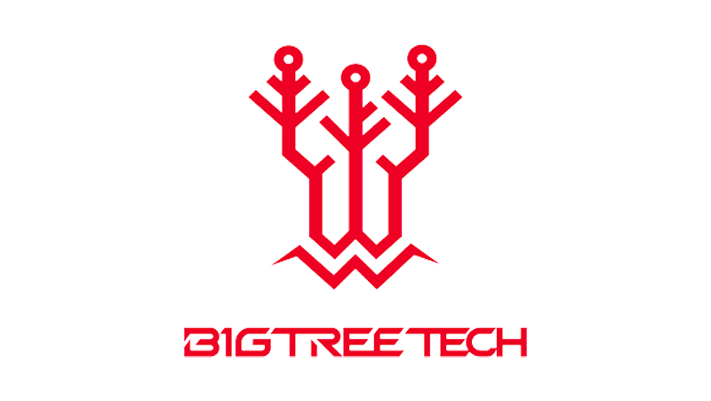
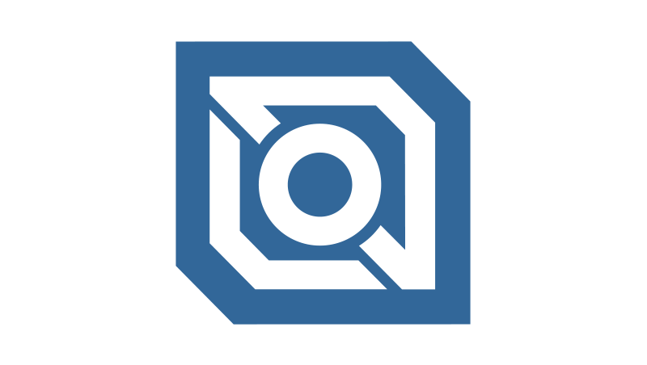
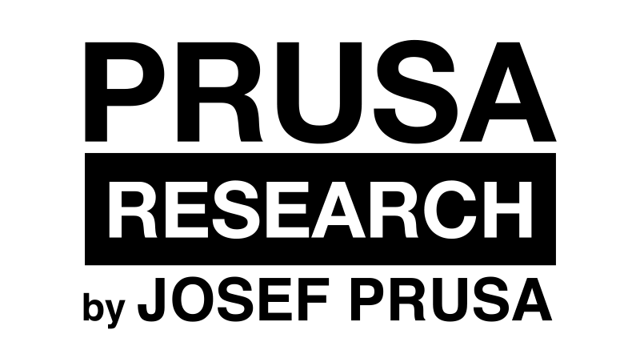
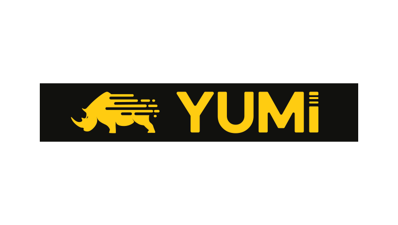
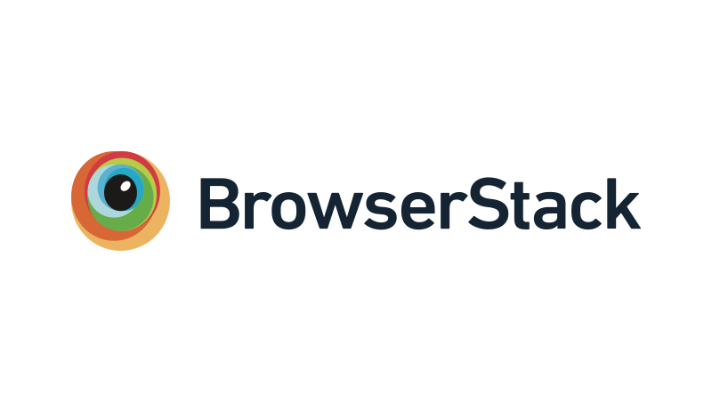
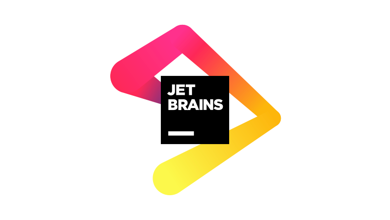
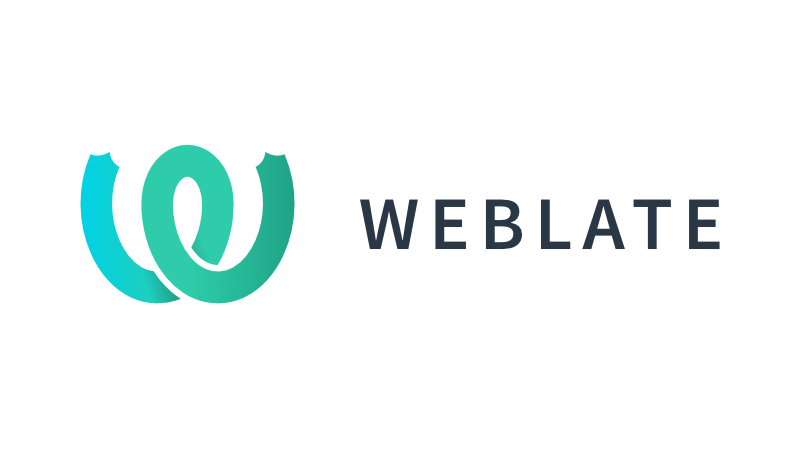

# Sponsors

Mainsail is an open source project with its ongoing development made possible entirely by the support of these
awesome sponsors.

!!! heart "Support Mainsail"

    You can support Mainsail development directly — either regularly or as a one-time donation:

    

    [:fontawesome-brands-patreon: Patreon](https://www.patreon.com/meteyou){ .md-button .md-button--primary target="_blank" }
    [:fontawesome-brands-github: GitHub Sponsors](https://github.com/sponsors/mainsail-crew){ .md-button .md-button--primary target="_blank" }
    [:simple-kofi: Ko-Fi](https://ko-fi.com/mainsail){ .md-button target="_blank" }
    

---

## Vendor Partners

These vendors support us financially in developing Mainsail. If you are also a vendor and use Mainsail on the
3D printers you sell, we would be happy if you also support us via
[Patreon](https://www.patreon.com/meteyou){:target="_blank"} or [GitHub](https://github.com/sponsors/mainsail-crew).

[{.sponsor-logo-large}](https://www.bigtreetech.com/){:target="_blank"}

[BIGTREETECH](https://www.bigtreetech.com/){:target="_blank"} is the **official mainboard partner** of Mainsail.
BIGTREETECH is committed to developing innovative and competitive products to serve the 3D printing community better.
Follow them on [Facebook](https://www.facebook.com/BIGTREETECH){:target="_blank"} or
[Twitter](https://twitter.com/BigTreeTech){:target="_blank"}.

  

  [{.sponsor-logo}](https://ldomotors.com/){:target="_blank"}
  **LDO Motors**
  

  

  [{.sponsor-logo}](https://www.prusa3d.com/){:target="_blank"}
  **Prusa Research**
  

  

  [{.sponsor-logo}](https://www.wanhao.store/){:target="_blank"}
  **Wanhao / Yumi**
  

---

## Open Source Licenses

These companies support us with free licenses to develop open-source software.

  

  [{.sponsor-logo}](https://www.browserstack.com/){:target="_blank"}
  **BrowserStack**
  

  

  [{.sponsor-logo}](https://www.jetbrains.com/){:target="_blank"}
  **JetBrains**
  

  

  [{.sponsor-logo}](https://weblate.org/){:target="_blank"}
  **Weblate**
  

