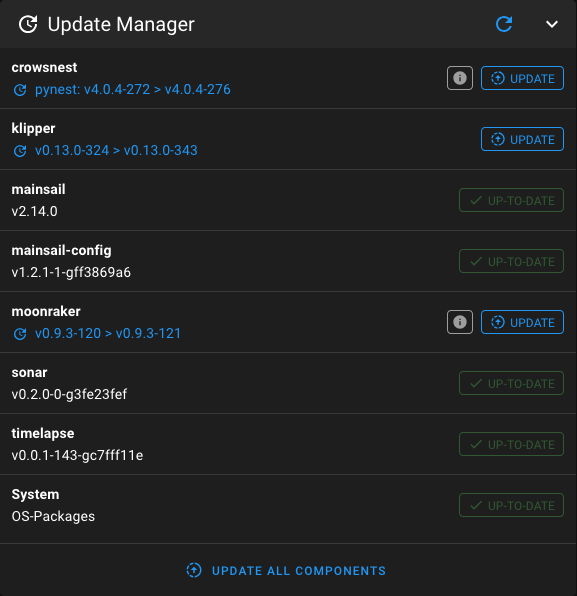
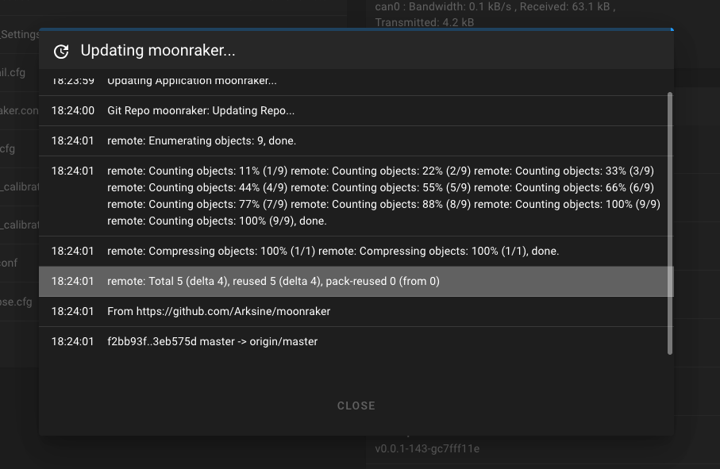

# Update Manager

The Update Manager is a Moonraker component that lets you update services like Klipper, Moonraker, Mainsail, and even
system packages directly from Mainsail.

!!! note
    On MainsailOS the Update Manager is already set up — you can skip the configuration step below.

## Enabling the Update Manager

The Update Manager must be enabled in `moonraker.conf`. You can edit it from Mainsail via the sidebar: Machine → File
Manager → `moonraker.conf`.

Add (or verify) the following sections:

```ini
[update_manager]
refresh_interval: 168
enable_auto_refresh: True

[update_manager mainsail]
type: web
channel: stable
repo: mainsail-crew/mainsail
path: ~/mainsail
```

- `refresh_interval` is in hours; the example config checks every 7 days (168 hours).
- Click on the `Save & Restart` button in the topbar to apply the changes and restart Moonraker

!!! note
    For more details on configuring the Update Manager in Moonraker, refer to the
    [Moonraker documentation](https://moonraker.readthedocs.io/en/latest/configuration/#update_manager){target="_blank"}

## Using Mainsail to update

With the Update Manager enabled, open the Machine tab. You should see the Update Manager panel and a list of components.
<figure markdown="span">
  
</figure>

### Check for updates

Click the reload button to let Moonraker check for new updates. Moonraker also checks periodically based on
`refresh_interval` in `moonraker.conf`.

### Check release notes

Click on the version number to open the release notes or the commit history for that component, to check what's new,
before updating.

!!! warning
    Some Klipper updates may require reflashing your MCUs. Without reflashing, your printer will not work. Avoid
    updating when you have important prints pending. Only update when you can afford to reflash and test your printer.

### Perform updates

The recommended order is top-to-bottom. To perform the update:

- Click "Update" for a single component, or
- Use "Update all components" to process everything at once.

A popup shows progress and details. Once done, close the window.

<figure markdown="span">
  
</figure>

## States of components

Components in the Update Manager can show different statuses:

- **UP-TO-DATE**: This component is on the latest version.
- **UPDATE / UPGRADE**: Updates are available (upgrade usually refers to system packages).
- **DETACHED**: The repository of this component is in a detached state. This means it is not on a branch; switch to a
  branch to receive updates or use the "Recovery" button.
- **DIRTY**: Local modifications were detected; recover if the changes were unintentional.
- **INVALID**: Something is wrong with the GIT state of this component.  
  Possible reasons include:
    - The repository is missing; use the "Recovery" button to re-clone it.
    - The directory is not a valid GIT repository.
    - GitHub is unreachable; check your internet connection.
    - for more details, check the Moonraker logs.
