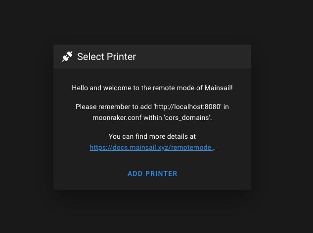
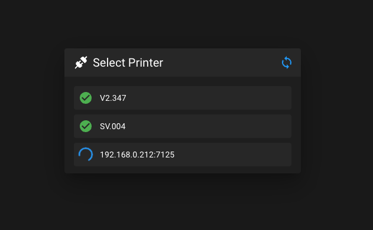

# {{ page.title }}
{{ page.description }}

There are several different modes of how Mainsail should react when a new session is opened. These settings can be done
in the `config.json` file in your Mainsail root directory. A default config.json file should look like this:

```json
{
    "hostname": null,
    "port": null,
    "remoteMode": false,
    "instances": [
      
    ]
}
```

## Remote Mode

This is the behaviour of mainsail when you use e.g. [my.mainsail.xyz](http://my.mainsail.xyz). If you have installed
the Mainsail instance independently of the various moonraker instances (printers). For example, you use a smart home
server or a NAS in your home network that can serve as a web server and is always accessible.

To use this mode, open the `config.json` and change the value `remoteMode` to `true`. If you now open Mainsail, you
should see this dialog.

{: width="50%" }

In this mode, the socket settings are saved in the browser and you can add as many printers as you like to the Mainsail
session using the "add printer" button.

## Remote Mode with fixed printers

This mode is very similar to the one described above, except that the Socket settings are not stored in the browser but
directly in the config.json file and are therefore automatically available in every browser (pc, tablet, smartphone).

With this mode, you have to switch the `remoteMode` as before to `true`, but then also have to specify a list of
printers in the `instances` array. Here an example:

```json
{
    "remoteMode": true,
    "instances": [
        { "hostname": "192.168.0.210", "port": 7125 },
        { "hostname": "192.168.0.211", "port": 7125 },
        { "hostname": "192.168.0.212", "port": 7125 }
    ]
}
```

In my example, 3 printers are added with the IP and with the default moonraker port 7125. When I now open mainsail, it
looks like this:

{: width="50%" }

In my example, you can see that the first two printers are already connected and the third one has not been reached
until now (it is currently switched off). For the first two printers, the name has also been loaded from the interface
settings.

## Fixed socket settings

This case is rather unusual, but it is also possible with Mainsail. Here you can set up a printer directly if it does
not match the currently opened url. For example, the web interface is available via `http://192.168.0.200` but the
printer (Moonraker) has the IP address `192.168.0.210`. Then the `config.json` should look like this:

```json
{
    "hostname": "192.168.0.210",
    "port": 7125
}
```

In this case, the specific printer simply opens immediately without the "select printer" dialog.

