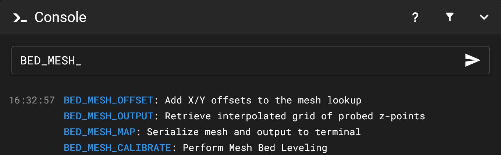
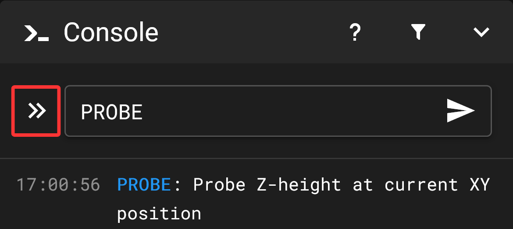
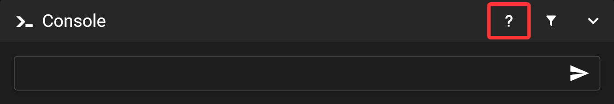
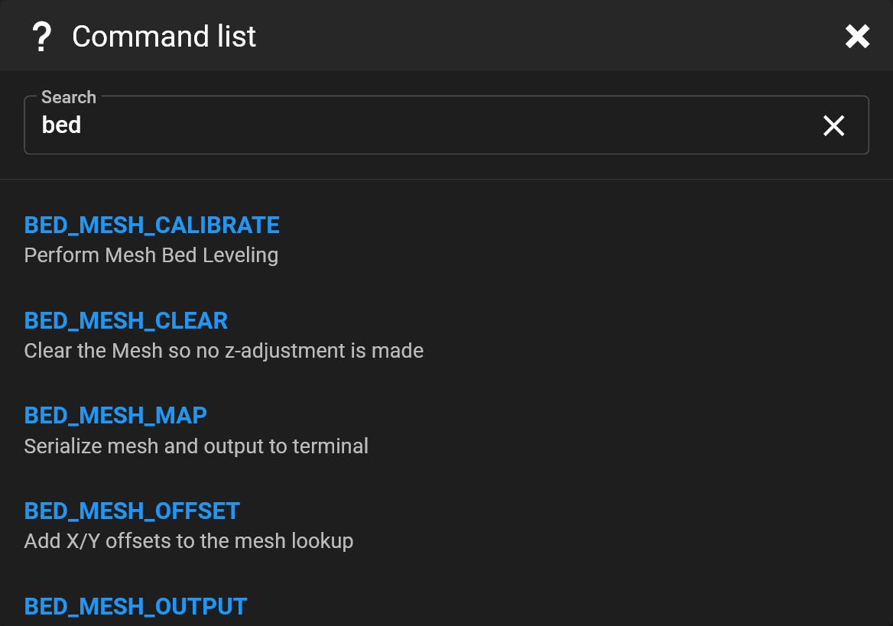
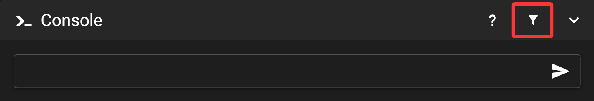

# {{ page.title }}
{{ page.description }} Mainsails console is available on the dashboard and as an extra page in the sidebar. 
{: .fs-5 }

## Send commands

Start typing in the Console. To submit a command press Enter key or click on the paper airplane in the input field.

 If you press the TAB key, the command will be completed to the next possible position. If there are several possibilities, you will get a list of choices. You can either click on a command to complete it, or just keep typing and press TAB key to complete it again.

**On mobile devices**  
*Mainsail will show you a tab button.*  
{: width="350px" }  
{: .info }

## Find commands

By clicking on the "?" icon in the title bar, you will get a list of possible commands and descriptions.

You can filter this list via the search text.

## Filter console output

Select filters by clicking the funnel button to suppress entries in the console output.

Mainsail currently comes with one predefined filter for temperature status messages. However, you can define additional filters in the settings.

You can find a description of the settings [here](/settings/console).  
{: .info }