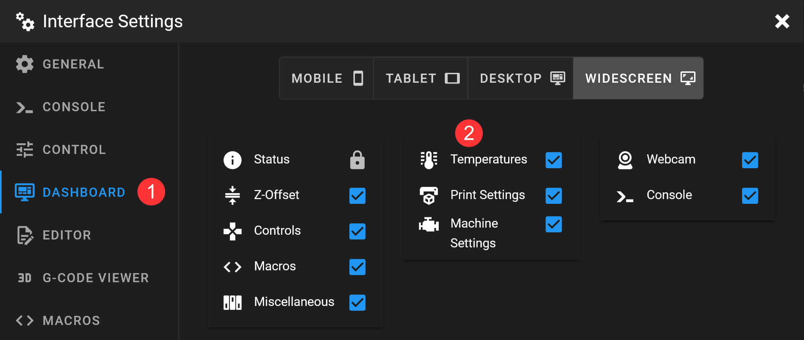
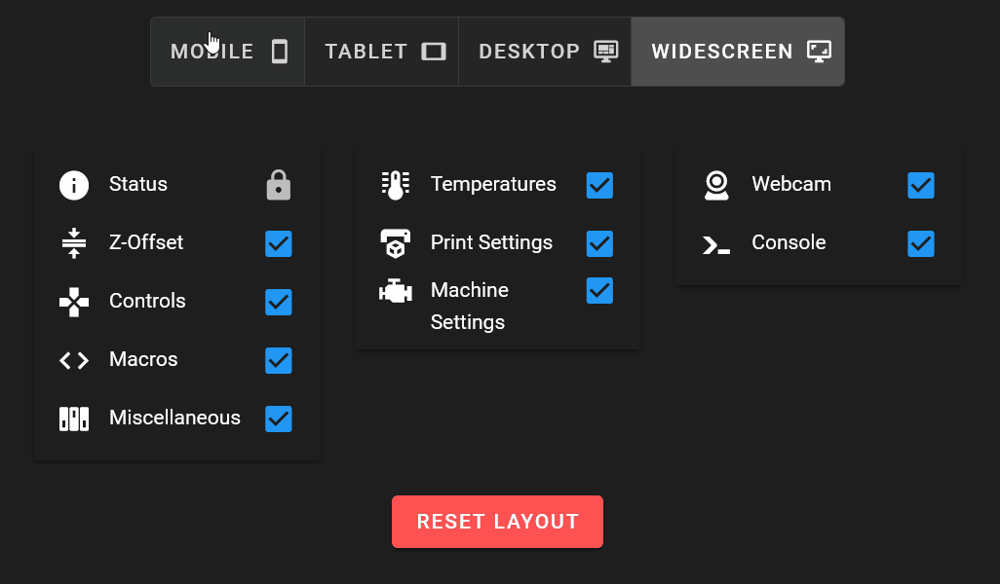
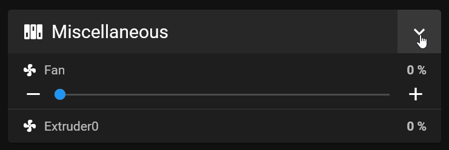
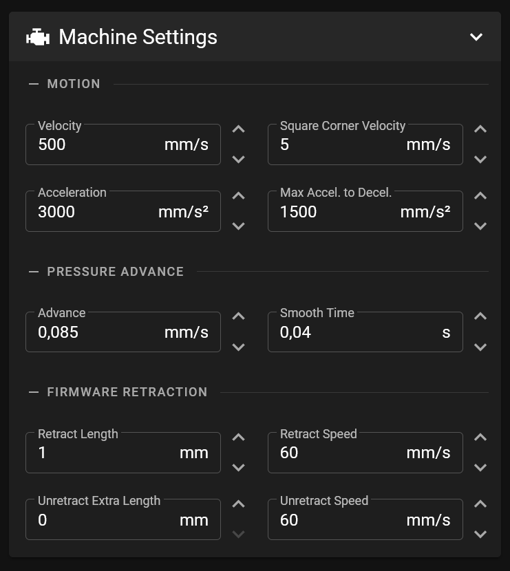

# {{ page.title }}
{{ page.description }}  
{: .fs-5 }

## Rearrange panels and show/hide them
To customize the dashboard panels, go to the settings by clicking on the two gears at the top right.

Go to the "DASHBOARD" section.

There the different elements can be selected and deselected and moved around.

Please note that different settings can ebe set **for each device class**. The device classes also have **different column layouts**. So, for example, it is possible to hide some panels on mobile devices that are displayed on desktops, in a different order.

## Collapsible panels

The panels on the dashboard can be collapsed to temporarily save space and expand them again when needed. Mainsail remembers the last setting.

## Subpanels

In some panels it is possible to switch subpanels on and off.

## Macro Management

Indirectly, the dashboard layout can also be customized through Mainsails macromanagement. In expert mode, macrogroups can be created that will be shown as panels on the dashboard. The macro colors can be customized and macros can be displayed depending on the printer status.

You can find more information at [Macro Management](/features/macro-management)