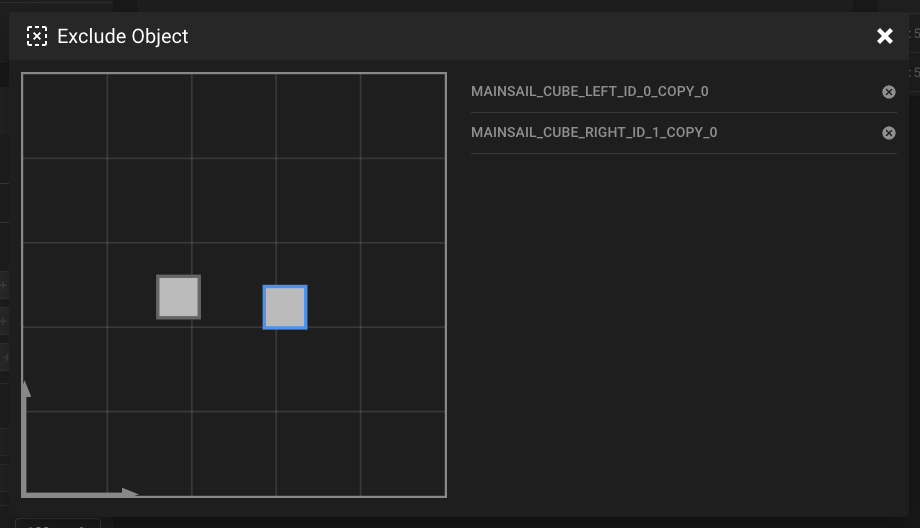
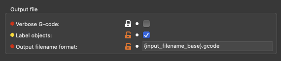
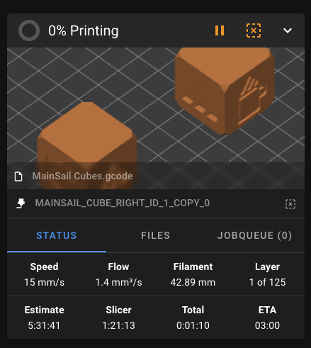

# {{ page.title }}
{{ page.description }}  
{: .fs-5 }

{:width="50%"}

This feature was integrated in Klipper v0.10.0-438, Moonraker v0.7.1-445 and Mainsail v2.1.0. Please check your
installed versions first and update them if necessary.

To be able to use this feature , the following steps are required.

## Enable `Label objects` in your slicer

In PrusaSlicer, Slic3r or SuperSlicer you have to enable the checkbox in:
```
Printer Settings > Output file > Label Objects
```
{:width="50%"}

## Enable gcode preprocessor in Moonraker

This step is necessary to convert the previously activated object labels into valid Klipper G-Code. Open your
`moonraker.conf` in Mainsail and add following setting to your config:
```
[file_manager]
enable_object_processing: True
```
This option might already exist in your `moonraker.conf`. Then you just have to change the value from `False` to `True`
and restart moonraker.
{: .info}

It is also possible to enable object processing directly in the slicer. See the
[preprocess-cancellation](https://github.com/kageurufu/cancelobject-preprocessor){:target="_blank"} documentation for
details.
{: .info}

## Enable `exclude_object` module in Klipper

Open your `printer.cfg` in Mainsail and add following setting to your config:
```
[exclude_object]
```

If you need more information about the exclude_object module in Klipper. See the
[exclude_object](https://www.klipper3d.org/Exclude_Object.html){:target="_blank"} documentation for details.
{: .info}

From now on all newly uploaded G-Codes should support this function and they should have a new button in the status
panel to exclude objects from printing.

{:width="50%"}
(the square icon with the X in the center)