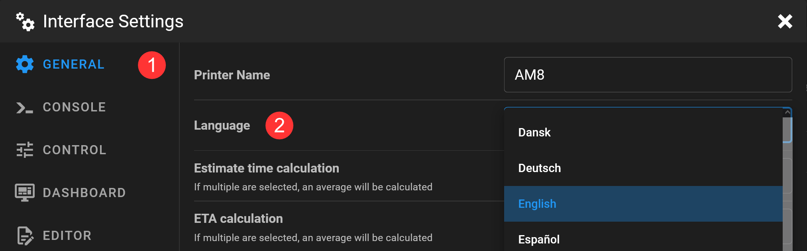

# {{ page.title }}
{{ page.description }}
{: .fs-5 }

## Select language

To change the language, go to the "Interface Settings" by clicking on the two gears at the top right.

In the "GENERAL" section, select your preferred language.

## Missing a translation or found an incorrect translation?

You are welcome to help us improve the translations. You can find instructions on how to do that over [here](/development/localization).

Get in touch with us on our Discord server. We will assign you a translator role for your language and inform you in advance when a new Mainsail version will be released, so that you can make the changes. 
{: .info}