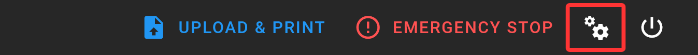
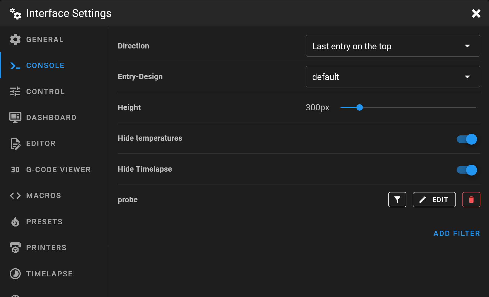
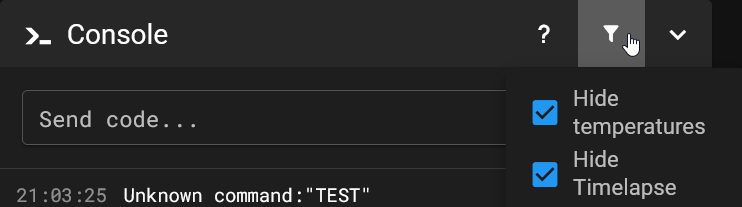
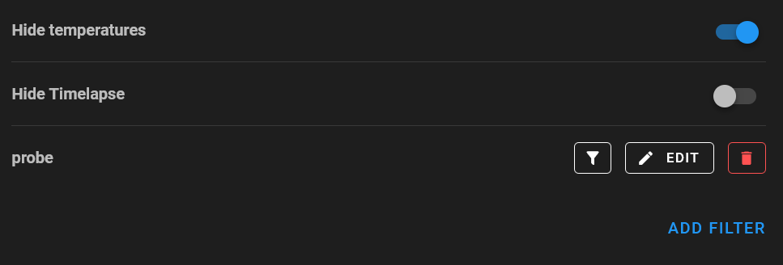
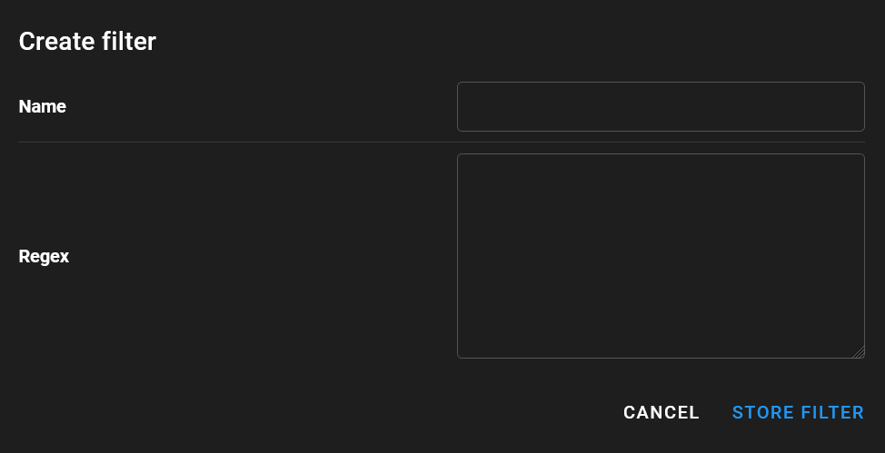

# {{ page.title }}
{{ page.description }}
{: .fs-5 }

For more information about the functionality of the console, please read the [feature description](/features/console).  
{: .info }

## Settings window
In order to change the settings, click on the two gears in the upper right corner and in the upcoming settings window click on the {{ page.title }} category.  
{: width="400px" }

## Direction
Change the direction of the console output. From top to bottom or vice versa.

This also affects whether the input field is located at the top or at the bottom.

## Entry-Design

It is possible to switch the appearance of console entries.

At the moment there is "default" and "compact". Compact comes without separators and smaller line spacing.

## Height

Specify the height of the console panel on the dashboard in pixels, so that it fits better into your dashboard layout.

## Console Filters

With console filters you can suppress entries from the console.

 The filters can be enabled and disabled in the settings or directly in the console panel via the funnel icon.

Mainsail lets you define, edit, delete your own filters, but also comes with predefined ones:

### Hide Temperatures

Filters all temperature status messages in the console.

### Hide Timelapse

Only the G-Code messages are filtered. 

The status messages can be switched in the Timelapse settings.

### Custom Filters

Get to this view, by clicking on the "ADD FILTER" button to create your own console filters with regular expressions.