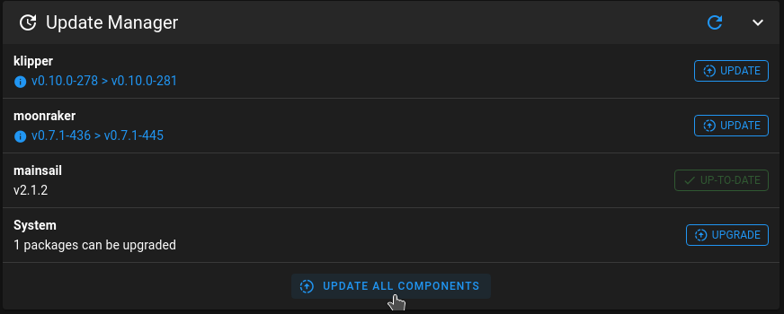

# First boot

Insert the flashed SD card into your Pi and hook up any other hardware such as:

- network cable, if you dont use WiFi
- 3D printer board connection (USB or Serial)
- or a webcam.

Power on the Pi and let it boot up.

**The initial boot of MainsailOS may take some time.**  
**MainsailOS expand your "root" filesystem to the whole size of your used SD Card.**  
**The larger the SD card, the longer the first boot will take.**
{: .warning}

Initially the green LED on the Pi will be extremely active.
After some time it will only intermittently flicker, indicating it has likely completed the boot sequence.

If you want to go sure that it is ready, login via SSH or spin up your Browser and navigate to:

```
http://mainsailos.local
```

or

```
http://<IP address of your Pi>
```

## Mainsail.cfg

**Important:** Include `mainsail.cfg` in your printer.cfg file
{: .warning}

Mainsail will not work correctly until `mainsail.cfg` is included in Klipper's configuration file.  
Open Klipper's default `printer.cfg` file in Mainsail's file manager located in:  
`Settings > Machine`  
If you do not have a `printer.cfg` file, you can create one.  
Add the following line to `printer.cfg`

```
[include mainsail.cfg]
```


and click on the `Save & Restart` button.

## Updates

Once you've successfully navigated to the Mainsail's web interface it is _strongly_ recommend that you run any available updates.
{: .info}

Klipper, Moonraker and Mainsail have fast development cycles and  
while we do our best to ensure MainsailOS ships as close to upstream as we can,  
there will always be a short delay before releases make it into MainsailOS' image.

It is recommended that you enable and use the [built in update-manager](../../update/update-manager).  
To perform any possible updates, simply click "UPDATE ALL COMPONENTS".



MainsailOS is now configured, and Klipper's configuration file, [printer.cfg], can be setup.

---

[< tool selection](../mainsail-os.md){: .btn } [next step >](klipper-setup){: .btn }
