This method is cross-platform and works with Windows, Linux and MacOS \
Raspberry Pi Imager appearance may vary depending on the host OS.
{: .info}

We **strongly** recommend you use a premium SD card from a reputable manufacturer such as Sandisk, Kingston or Samsung, using an "A1" (or better) grade SD card. \
\
Low end cards will often fail quickly when used in this application.
{: .warning}

**FLASHING WILL DESTROY ALL DATA ON YOUR SD CARD AND CANNOT BE REVERSED**
{: .alert}

---

# Preparation

- [Download](https://www.raspberrypi.org/software/) and install the latest Raspberry Pi Imager (v1.7.1).

# Flashing MainsailOS

- When opening Raspberry Pi Imager you will be presented with the following:

- Select "CHOOSE OS", and a popup will open as illustrated below.
- Scroll down to "Other specific-purpose OS"

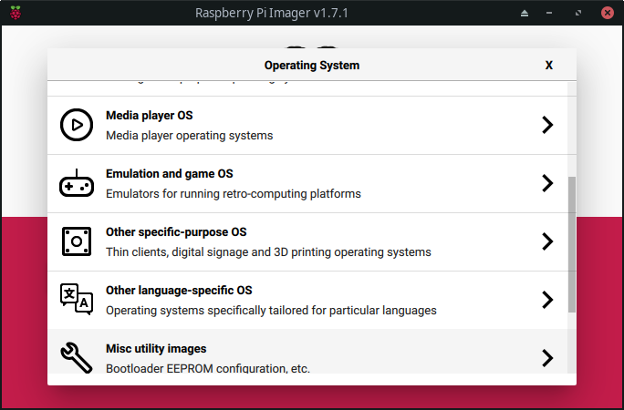

- Select "3D printing"

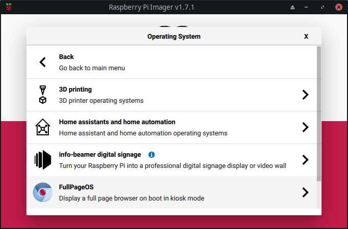

- Choose your prefered 3D printing OS (Mainsail for sure)

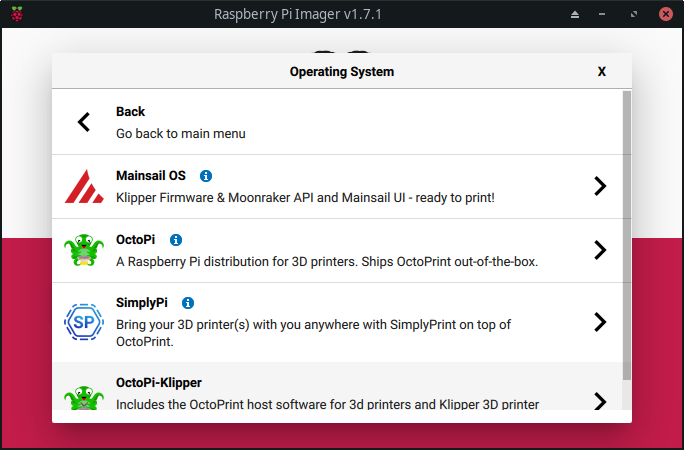
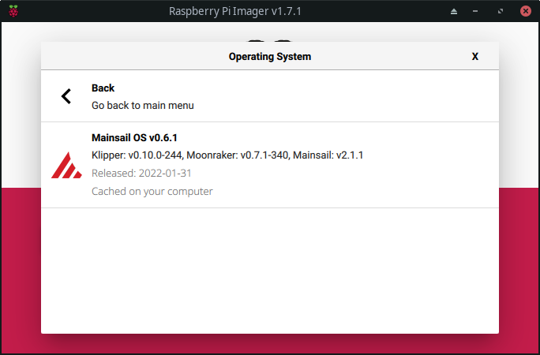

- After that is done hit "STORAGE" and select your desired SD card.

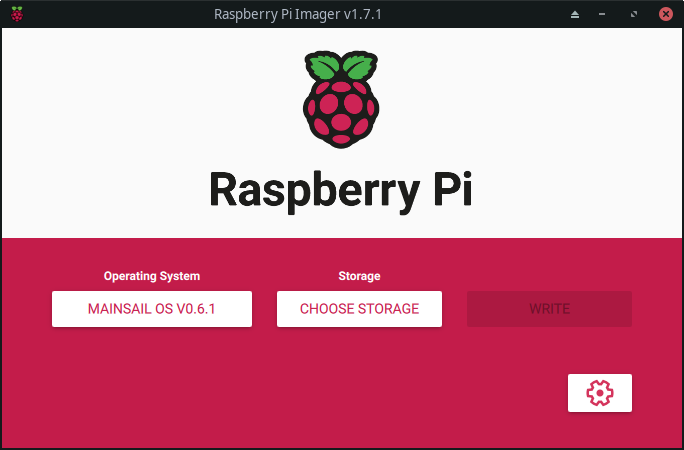

- For example:

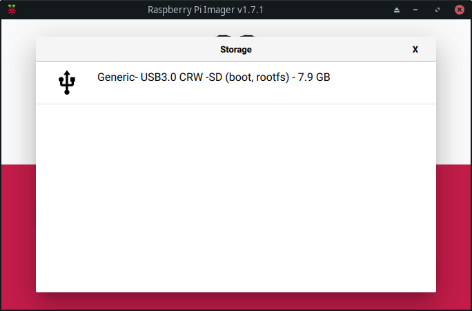

- Now it is time to hit the little cogwheel in the right corner.

- Enable SSH.

As a bare minimum, setup SSH and a network connection  
at this point, especially if performing a 'headless' installation.
{: .info}

- Optional: Setup your prefered hostname

If you change the hostname, the URL will be changed accordingly.\
As shown in the screenshot below your URL will be **_http://mainsail.local_**
{: .alert}

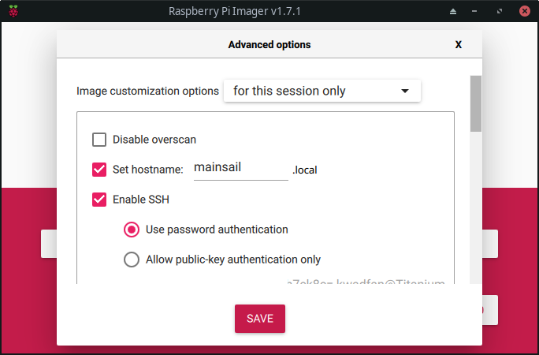

- Change your password, this step is highly recommended!

**Please don't change the username!**  
At this stage MainsailOS Setup relays on the user "pi".  
We will change that in the future.
{: .alert}

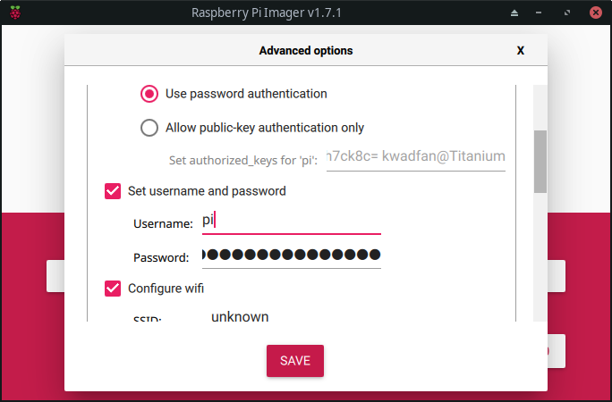

- If you want to use WiFi instead a wired connection,  
  please configure your WiFi accordingly.

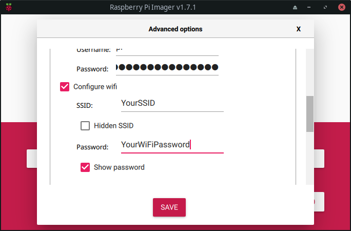

- The last point handles your Timezone and Keyboard Layout  
  (Keyboard Layout may affect your language in some cases)

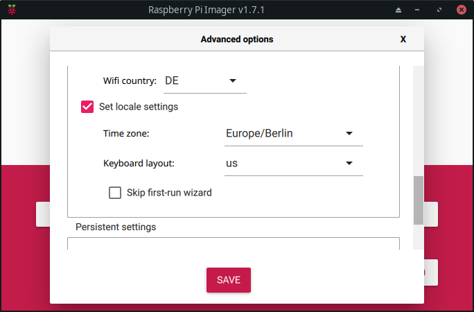

- With all desired options preconfigured, click on "WRITE" and accept the warning.

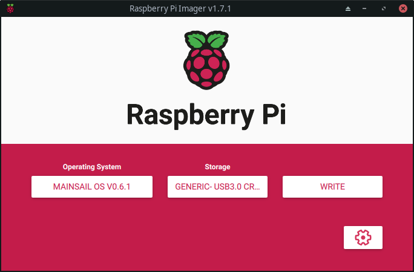

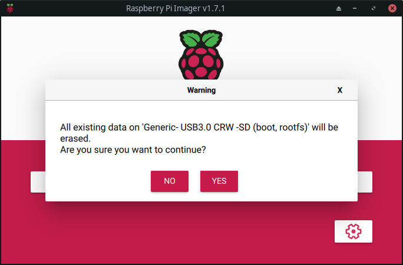

- Imager will take some time to write the image to the SD card.  
  _When it finished the transfer to your SD Card, it will verify your Image._

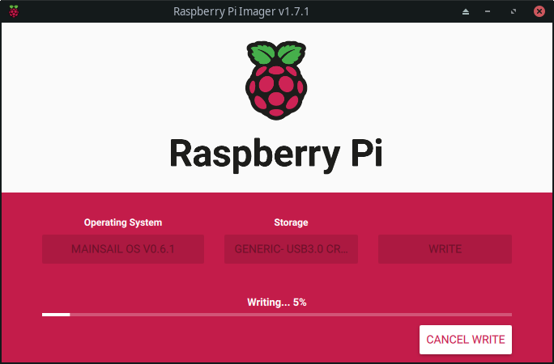

Select the "CONTINUE" button and unmount (safely remove) your newly flashed MainsailOS SD card.

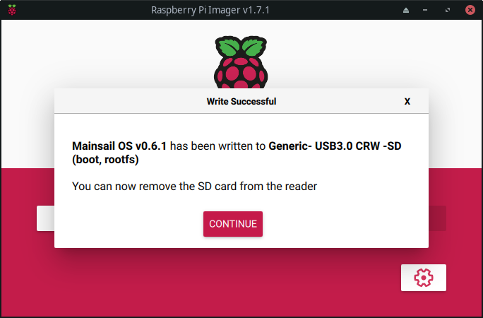

You are now ready to move on to the [first boot](first-boot) of MainsailOS.

---

[< tool selection](../mainsail-os.md){: .btn } [next step >](first-boot){: .btn }
